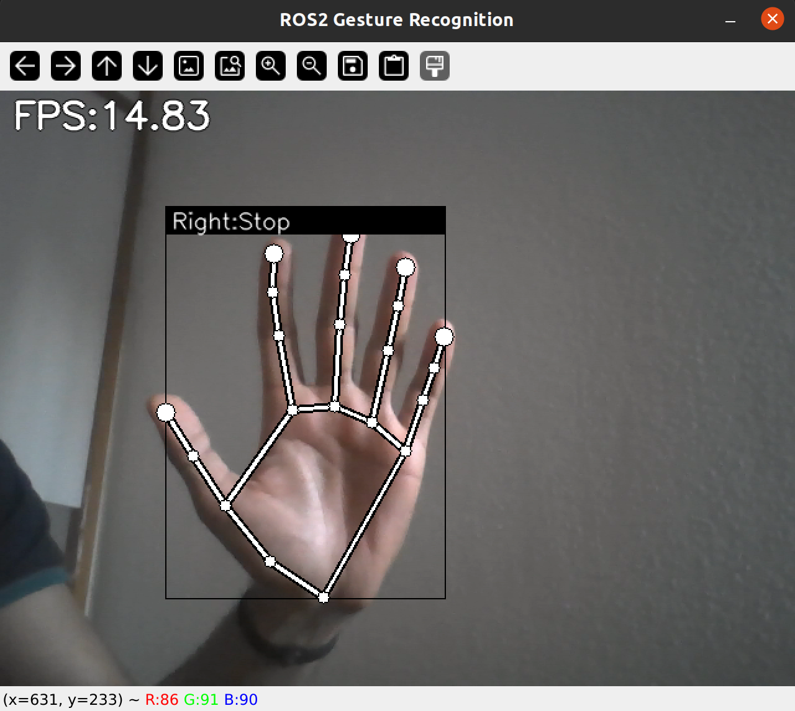

# Py_handgesture Recognition project- ROS2 humble
This project uses Ros2-humble to implement the hand sign recognition pipeline using laptop webcam and pretrained classifier models from mediapipe. This implementation is a self-learning project to map ROS-noetic pipeline to a ROS2-humble one.

The referance for this project is [ROS_hand_gesture_recognition project](https://github.com/TrinhNC/ros_hand_gesture_recognition/tree/main) which implements this in ROS-noetic.

The output of the project is recognition of 5 signs: Go, Stop, Backward, Turn Left and Turn Right. 

